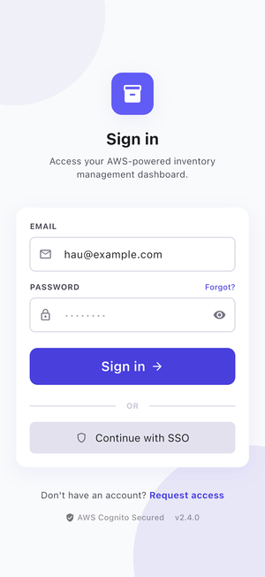
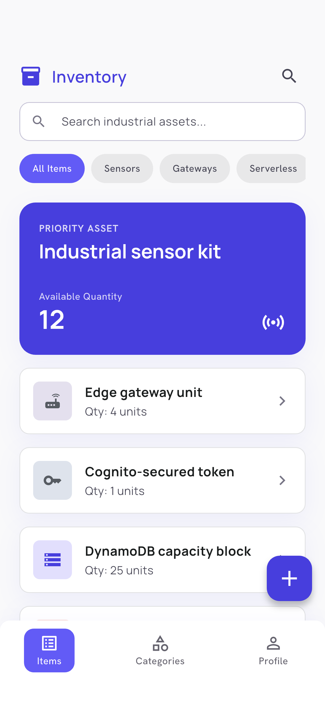
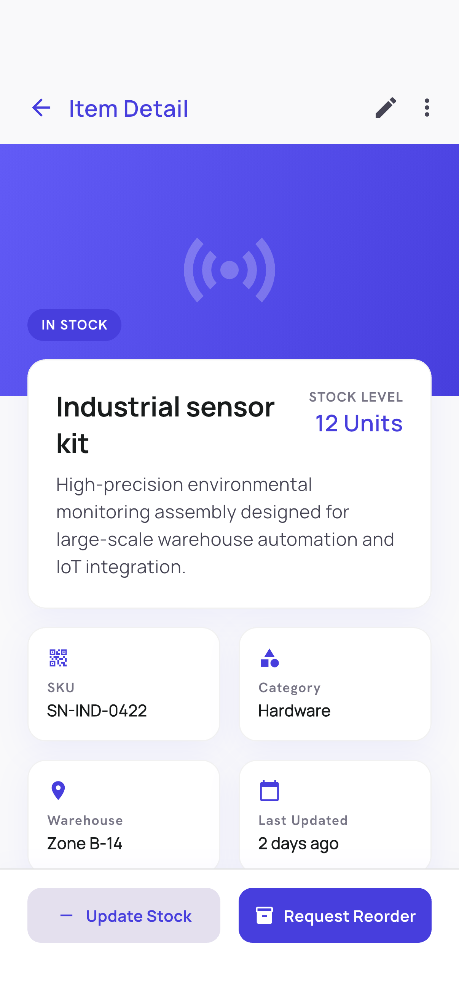
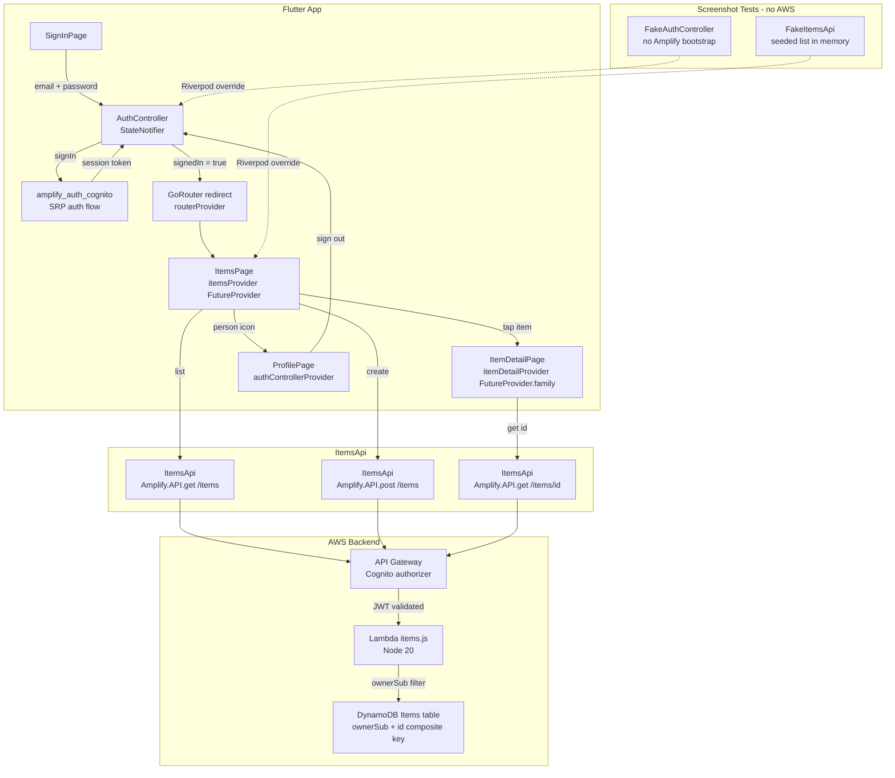

# flutter-aws-serverless

A **Flutter** + **Riverpod** mobile client wired to a fully serverless AWS backend: **AWS Cognito** for auth, **API Gateway** with a Cognito User Pool authorizer, a **Node 20 Lambda** function, and a **DynamoDB** table with per-user multi-tenancy. Infrastructure is defined in **AWS CDK** (TypeScript). The app demonstrates end-to-end connectivity, token-authenticated REST calls, and redirect-based auth gating via `go_router`.

The UI follows a custom **Modern Ethos** design system (Manrope typography, vibrant-lavender primary, soft-focus shadows, rounded card architecture) designed in Google Stitch and ported to a Flutter theme in `lib/core/theme.dart`.

## Demo

Animated walkthrough captured on the iOS Simulator (Sign in, Items list, Item detail, Profile).



## Screenshots

| Sign in | Items | Item detail | Profile |
| --- | --- | --- | --- |
|  |  |  |  |

## Features

- Cognito User Pool sign-in via `amplify_auth_cognito` (SRP auth flow)
- `Amplify.API` REST calls to API Gateway with the Cognito ID token attached automatically
- Cognito User Pool authorizer enforced on every Lambda route
- DynamoDB items scoped by `ownerSub` (multi-tenant, one partition per user)
- `GET /items`, `POST /items`, `GET /items/{id}`, `DELETE /items/{id}` endpoints
- Redirect-based auth gating in `go_router` - unauthenticated users are sent to `/sign-in`
- Pull-to-refresh items list with featured priority card, filter chips, stats grid, and a floating action button to create an item
- Item detail with hero banner, spec bento grid, technical specifications, and an inventory-movement bar chart
- Profile page with account details, system-settings toggles, and a sign-out button, plus a pill-style bottom navigation bar

## Stack

- **Flutter** 3.22+ with **Riverpod** 2 (`StateNotifier`, `FutureProvider`, `FutureProvider.family`)
- **go_router** 14 for declarative navigation with auth redirect
- **amplify_flutter** 2 / **amplify_auth_cognito** / **amplify_api** for AWS integration
- **AWS CDK** (TypeScript) for infrastructure-as-code (`infra/cdk/stack.ts`)
- **Node 20 Lambda** (AWS SDK v3 DynamoDB Document Client) (`infra/lambda/items.js`)
- **Amazon DynamoDB** PAY_PER_REQUEST billing, composite key (`ownerSub` + `id`)
- **Amazon Cognito** User Pool with self sign-up, email alias, SRP auth

## Architecture

```
lib/
  main.dart                    # Amplify.configure + ProviderScope + MaterialApp.router
  core/
    amplify_config.dart        # Cognito/API Gateway endpoint constants
    router.dart                # GoRouter with auth-gating redirect
    auth/
      auth_controller.dart     # AuthController (StateNotifier) + AuthState
      sign_in_page.dart        # Sign-in form -> AuthController.signIn
    api/
      items_api.dart           # ItemsApi + Item model + itemsApiProvider
  features/
    items/
      items_page.dart          # itemsProvider (FutureProvider) -> ItemsApi.list
      item_detail_page.dart    # itemDetailProvider (FutureProvider.family) -> ItemsApi.get
    profile/
      profile_page.dart        # reads authControllerProvider for email
infra/
  cdk/
    stack.ts                   # CDK: Cognito UserPool, DynamoDB, Lambda, API Gateway
  lambda/
    items.js                   # Node 20 handler: GET/POST/DELETE /items
integration_test/
  screenshot_test.dart         # Riverpod overrides (FakeItemsApi, FakeAuthController)
test_driver/
  integration_test.dart        # flutter drive entry point (onScreenshot -> PNG)
```



## Mock data

The integration test (`integration_test/screenshot_test.dart`) uses two in-memory fakes injected via Riverpod provider overrides, so no live AWS account is needed to capture screenshots.

**`FakeItemsApi`** (extends `ItemsApi`) overrides `list()` and `get(id)` with a hardcoded seed list:

| id | name | qty |
| --- | --- | --- |
| a1 | Industrial sensor kit | 12 |
| a2 | Edge gateway unit | 4 |
| a3 | Cognito-secured token | 1 |
| a4 | DynamoDB capacity block | 25 |
| a5 | Lambda warm pool | 8 |
| a6 | API Gateway stage | 3 |

**`FakeAuthController`** (extends `AuthController`) overrides `bootstrap()` with a no-op so Amplify is never initialized; its state is set directly to `AuthState(signedIn: true, email: 'hau@example.com')` for the Profile screen shot.

The overrides are applied with `ProviderScope(overrides: [...])` in each test widget, keeping production code and test fakes cleanly separated.

## Run

```bash
# 1. Deploy infrastructure (requires AWS credentials + CDK bootstrap)
cd infra/cdk
npm install
npx cdk deploy

# 2. Copy CDK outputs into lib/core/amplify_config.dart
#    Replace REPLACE_USER_POOL_ID, REPLACE_APP_CLIENT_ID, and the API endpoint.

# 3. Run the app on a simulator or device
flutter pub get
flutter run
```
